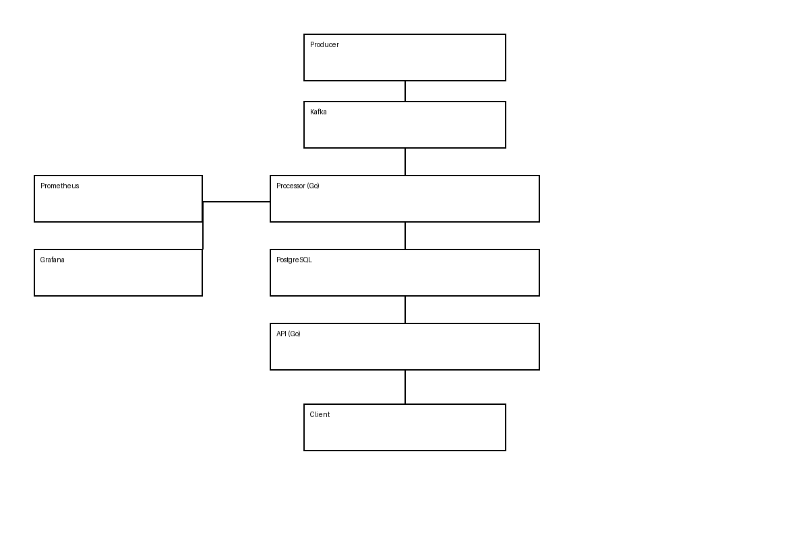

#  Scalable Blockchain Event Processing & API Platform

A production-ready backend system that ingests blockchain events in real-time using Kafka, processes them efficiently, stores them in PostgreSQL, and exposes a high-performance API with observability via Prometheus & Grafana.


---

##  Architecture
<p align="center">
  
</p>


---

##  Tech Stack

| Layer      | Technology |
| ---------- | ---------- |
| Language   | Go         |
| Messaging  | Kafka      |
| Database   | PostgreSQL |
| API        | net/http   |
| Monitoring | Prometheus |
| Dashboard  | Grafana    |
| Container  | Docker     |

---

##  Getting Started

###  Clone the repo

```bash
git clone https://github.com/Prasanna25-20/-blockchain-event-pipeline.git
cd -blockchain-event-pipeline
```

---

###  Start services

```bash
docker-compose up --build
```

---

###  Create Kafka topic

```bash
docker exec -it project2-kafka-1 bash
kafka-topics.sh --create \
  --topic events \
  --bootstrap-server kafka:9092 \
  --partitions 1 \
  --replication-factor 1
```

---

###  Send events

```bash
kafka-console-producer.sh --broker-list kafka:9092 --topic events
```

---

### Access API

```bash
curl http://localhost:8080/events
```

---

## Monitoring

* Prometheus → http://localhost:9090
* Grafana → http://localhost:3000

---

##  Example Metrics

* API request count
* API latency
* Event processing rate
* System performance

---

##  Project Structure

```
project2/
├── api/                # API service
├── processor/          # Event processor
├── assets/             # Images & diagrams
├── docker-compose.yml
├── prometheus.yml
├── init.sql
└── README.md
```

---

##  Highlights

* Handles real-time event streams
* Designed for scalability and reliability
* Production-style architecture
* Observability included

---

##  Future Improvements

* Kubernetes deployment
* Load balancing (NGINX)
* Authentication & rate limiting
* Distributed tracing

---

##  Author

**Prasanna**

* GitHub: https://github.com/Prasanna25-20

---
